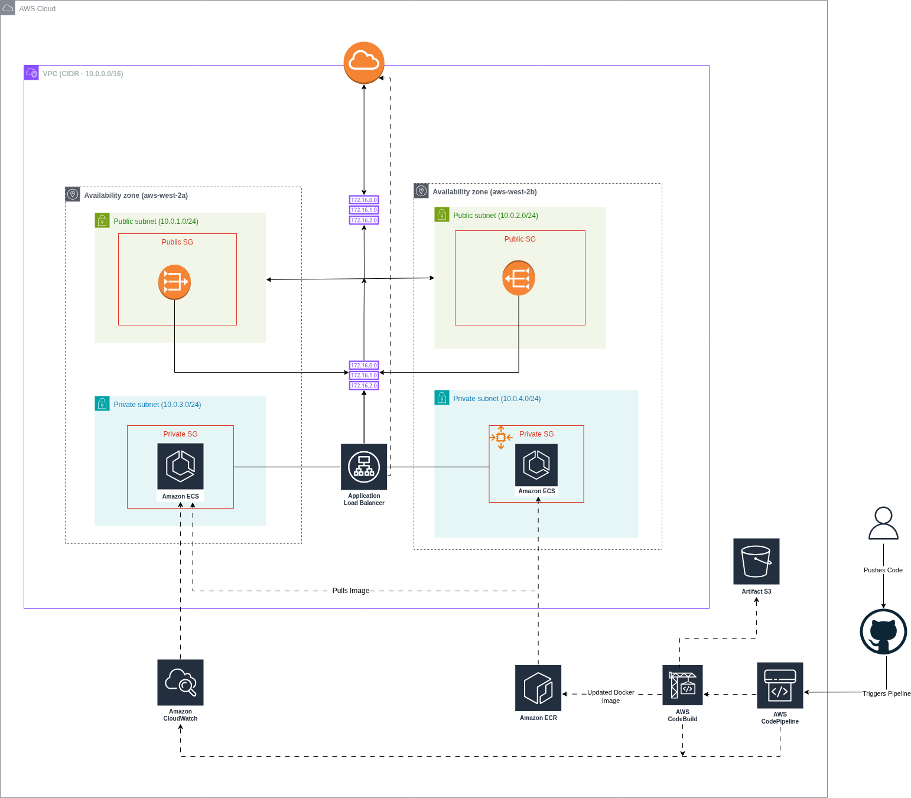

# **NodeJS-Deployment-on-AWS-ECS-EC2-using-CodePipeline**

## **Objective**
Deploy a NodeJS application on **Amazon ECS (EC2 launch type)** using a **CI/CD pipeline** with **CodePipeline, CodeBuild, ECR, ALB, and CloudWatch**.

---

## **Architecture Diagram**

---
## **Services & Tools Used**
| **Category**       | **Services/Tools**                                                                                     |
|--------------------|-------------------------------------------------------------------------------------------------------|
| **Networking**     | VPC, Public/Private Subnets, Internet Gateway, NAT Gateway, Route Tables, Security Groups             |
| **Compute**        | ECS (EC2 launch type), Auto Scaling Group, Launch Template, EC2 Instances                              |
| **Load Balancing** | Application Load Balancer (ALB), Target Groups                                                        |
| **Container**      | Amazon ECR, Docker                                                                                     |
| **CI/CD**          | AWS CodePipeline, AWS CodeBuild, GitHub                                                              |
| **Monitoring**     | Amazon CloudWatch (Logs, Metrics)                                                                    |
| **Source Control** | GitHub                                                                                               |

---

